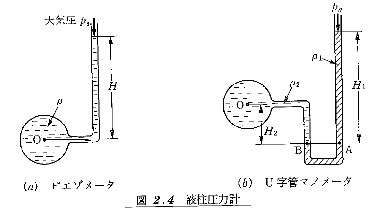
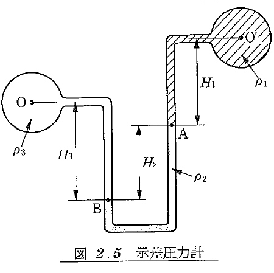
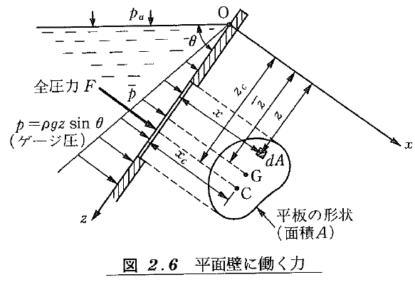
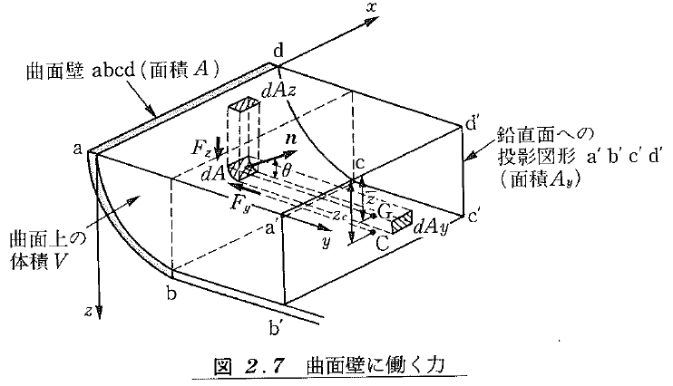

<!-- _class: title -->
<!-- # こちらはMarp用のTitle -->
# 流体力学の基礎

---

<!-- _class: slide1 -->
### Table of Contents

1. 流体の諸性質
2. 静止流体の力学
3. 定常1次流れ
4. 流量・流速測定の原理
5. 運動量理論
6. 次元解析と相似則
7. 管路の流れ
8. 流体力学の基礎式
9. 層流の理論的解析
10. 2次元ポテンシャル流の基礎

---

<!-- _class: chapter -->
## 流体の諸性質

---

<!-- _class: slide1 -->
### はじめに
- 物質の状態 : 固体・液体・気体
- 流体 : 液体・気体のように形状に応じて自在に変形
- 連続体の仮定 𝐾𝑛 : クヌーセン数
- $\lambda$ 分子の平均自由工程 $𝐿$: 物体の代表長さ
- $$ K_n ≡ \lambda / L < 0.01 $$
- 平均自由行程
  - 「気体分子運動論」という学問的な取り扱いの中だけでいえる話で、理論上の計算値として求められ、圧力が低いほど、分子の数が少ないほど気体分子はまっすぐ飛べるので、平均自由行程は長くなる

---

<!-- _class: slide1 -->
### 単位系
1. 国際単位系(SI) 七つの基本単位で構成
- 長さ 𝑚 (メートル)、質量 𝑘𝑔 (キログラム)、時間 𝑠𝑒𝑐 (秒)
- 電流 𝐴 (アンペア)、熱力学温度 𝐾 (ケルビン)、物質量 𝑚𝑜𝑙 (モル)、光度 𝑐𝑑 (カンデラ)
- 𝑁 (ニュートン) 組立単位 1𝑁=1𝑘𝑔×1𝑚/𝑠^2
1. 工学単位系(重力単位系)
- 長さ、力、時間の三つを基本量としている
- 質量の物体に働く重力の大きさ 1𝑘𝑔𝑓=1𝑘𝑔×9.8𝑚/𝑠^2=9.8𝑁
1. CGS単位系
- 長さ、力、時間に 𝑐𝑚,𝑔,𝑠 を用いる単位系

---

<!-- _class: slide1 -->
### 密度と比体積
- 密度 $\rho$ : 単位体積当たりの質量
- SI単位系 $kg/m^3$
- 比重量 $\gamma$ : 単位体積当たりの質量 $\gamma = \rho g$
- 工学単位系 $kgf/m^2$ 
- 比体積  $𝑣$ : 単位重量と物体の体積
- $$ v = 1 / \rho $$

---

<!-- _class: slide1 -->
### 圧縮性
- 実在の流体は作用する圧力の増減に応じて収縮・膨張する
- 体積弾性率 $K \ [N/m^2 = Pa]$
  - 圧力変化を $dp$ 体積を $v$  体積変化した量 $dv$
  - $$ K \equiv \frac{dp}{dv/v} = \frac{dp}{d\rho/\rho} $$
  - 体積弾性率の値が大きいほど、同じ圧量変化に対して体積変化は小さくなる
  - 圧縮率 $\beta$
  - $$ \beta \equiv \frac{1}{K} = -\frac{dv/v}{dp} $$
- 流体は圧力変化による体積変化が小さいので非圧縮性流体
- 気体は圧力変化による体積変化が大きいので圧縮性を考慮する必要があるケースがある

---

<!-- _class: slide1 -->
### ニュートンの粘性法則
::::::::::::::: {.columns}
::: {.column}
- 流体の粘性 : 変形に対して抵抗する性質(水あめは強く、水は弱い)
- クエット流れ
  - 平行な2枚の平板間に油を満たし、下の板を固定し上の板を一定の速度 $U$ で平行に動かす流速が遅い場合、流速 $v$ の $y$ 方向分布は固定壁面 $(y=0)$ における $(u=0)$ から移動壁面 $(y=0)$ における $(u=U)$ まで直線的に変化する分布となる
  - この時板を動かすのに必要な力 $F$ は、板の面積 $A$ と速度 $U$ に比例し、平板板間の距離 $h$ に反比例する
  - $$ F \propto \frac{AU}{h} $$
  - せん断応力 $\tau$ : 板の単位面積あたりに作用する摩擦効力
  - $$ \tau = \frac{F}{A} \propto \frac{U}{h} = \frac{du}{dy} $$
  - ニュートンの粘性法則 : 粘度(流体固有の物性値) $\mu \ [N\cdot s/m^2 = Pa\cdot s]$
  - $$ \tau = \mu \frac{du}{dy} $$
  - ニュートン流体 : ニュートンの粘性法則が成り立つ流体 → 空気・水・グリセリン・油など
  - 動粘度 $\nu \ [m^2/s]$ : 流体の運動を調べるのにはこちらが使われる
  - $$ \nu = \frac{u}{\rho} $$
:::

::: {.column}

:::
::::::::::::::::::::::::::
<!--  for Marp -->

---

<!-- _class: slide1 -->
### 粘度・動粘度
- 標準大気圧における水と空気の粘度 $\mu$ 、動粘度 $\nu$
  - 粘度および動粘度の温度上昇による変化
    - 液体 : 減少 柔らかくなる
    - 気体 : 増加 硬くなる

| 温度℃ | 水 粘度$\mu$ | 水 動粘度$\nu$ | 空気 粘度$\mu$ | 空気 動粘度$\nu$ |
<!-- | :---: | :----------: | :------------: | :------------: | :--------------: | -->
|   0   |  1.792e-03   |   1.792e-03    |   1.724e-05    |     13.33e-6     |
|  10   |  1.307e-03   |   1.307e-03    |   1.773e-05    |     14.21e-6     |
|  20   |  1.002e-03   |   1.004e-03    |   1.822e-05    |     15.12e-6     |
|  30   |  0.797e-03   |   0.801e-03    |   1.869e-05    |     16.04e-6     |
|  40   |  0.653e-03   |   0.658e-03    |   1.915e-05    |     16.98e-6     |

---

<!-- _class: slide1 -->
### 粘性による流体の分類
::::::::::::::: {.columns}
::: {.column}
- ニュートン流体
- 非ニュートン流体
  - ニュートンの粘性法則に従わない流体
  - 速度勾配により粘度が異なる
- ダイタラント流体
  - 下に凸 ミルクチョコレート、波打ち際の砂など
- 擬塑性流体
  - 上に凸 濃縮ジュース、マヨネーズなど
- ビンガム流体
  - ケチャップなど
:::

::: {.column}

:::
::::::::::::::::::::::::::
<!--  for Marp -->

---

<!-- _class: slide1 -->
### 表面張力
::::::::::::::: {.columns}
::: {.column}
- 液体と気体、互いに溶け合わない液体同士などの液体界面に働く。液体表面に薄い膜が張られているような現象
  - 表面量力による圧力差
    - 辺の長さ $ds_1, \ ds_2$ の液の内部と外部の圧力差 $\Delta p$
    - 液面の主曲率半径 $R_1, \ R_2$ 中心角 $d\theta_1, \ d\theta_2$
    - 液面の周囲の働く表面張力の $z$ 軸に平行な成分
$$ 2\sigma ds_2 \sin frac{d\theta_1}{2} + 2\sigma ds_1 \sin frac{d\theta_2}{2} \approx \sigma ds_2d\theta_1 + \sigma ds_1d\theta_2 $$
:::

::: {.column}

:::
::::::::::::::::::::::::::
<!--  for Marp -->

---

<!-- _class: slide1 -->
### 毛管現象
::::::::::::::: {.columns}
::: {.column}
- 細いガラス管を水中に立てると、管内の水面が上昇する現象
- 液体の凝集力と壁面への付着力の大小関係により上昇が下降かが決まる
- 内径 $d$ の毛細管を液中に立て、毛管現象による液面の上昇量 $h$ を求める
- 液体の密度 $\rho$ 、表面張力 $\sigma$、接触角 $\theta$ より力のつり合いを考える
$$ \pi d\sigma\cos\theta = \frac{\pi}{4}d^2h\rho g $$
- 液面の高さは
$$ h = \frac{4\sigma}{\rho gd}\cos\theta $$
- 接触角 $\theta$ の値
  - 水の場合にはほぼ $0^\circ$ 液面が上昇
  - 水銀の場合には約 $135^\circ$ 液面が下降
:::

::: {.column}

:::
::::::::::::::::::::::::::
<!--  for Marp -->

---

<!-- _class: chapter -->
## 静止流体の力学

---

<!-- _class: slide1 -->
### 圧力の等方性
- 静止流体中では任意の1点における圧力はあらゆる方向に等しい
- 流体中の1点を通る微小平面 $\Delta A$ の圧力は以下の式で定義される
$$ p \equiv \lim_{\Delta A \rightarrow 0} \frac{\Delta F}{\Delta A} $$
  - 圧力の単位
    - $[N/m^2] = [Pa]$
    - $[kgf/cm^2], [mmAg], [mmHg], [bar]$
  - 圧力の表し方
    - 絶対圧 : 絶対真空（完全真空）を基準として表した圧力 
    - ゲージ圧 : 周囲の圧力を基準として表し、通常大気圧が基準で $1.013\times 10^5$

---

<!-- _class: slide1 -->
### 圧力分布 1
::::::::::::::: {.columns}
::: {.column}
- 密度 $\rho$ の流体中に微小四面体 $OABC$ を考える
  - 斜面 $ABC$ の法制が $x, y, z$ 軸となす角度を $\alpha, \beta, \gamma$、$\triangle ABC$ の面積を $dA$ とする
  $$ \triangle OBC = \frac{1}{2}dydz = dA\cos\alpha $$
  $$ \triangle OAC = \frac{1}{2}dxdz = dA\cos\beta $$
  $$ \triangle OAB = \frac{1}{2}dxdy = dA\cos\gamma $$
  - $x, y$ 方向の力のつり合いより
  $$ p_x\frac{1}{2}dydz - p_ndA\cos\alpha = 0 \therefore p_x = p_n $$
  $$ p_x\frac{1}{2}dxdz - p_ndA\cos\beta = 0 \therefore p_y = p_n $$
  - $z$ 方向は流体の自重を考慮する
  $$ p_x\frac{1}{2}dxdy - p_ndA\cos\gamma -\rho g \frac{1}{6}dxdydz = 0 \therefore p_z = p_n + \rho g \frac{1}{3}dz $$
  - $dz\rightarrow0$ では $p_z = p_n$ より $p_x = p_y = p_z = p_n$ となる
:::

::: {.column}

:::
::::::::::::::::::::::::::
<!--  for Marp -->

---

<!-- _class: slide1 -->
### 圧力分布 2
::::::::::::::: {.columns}
::: {.column}
1. 圧力分布
- 有限体積の流体に作用する外力
  - 表面力 : 流体部分の表面に働く外力
  - 体積力 : 重力や電磁気力などの流体の実質部分に直接作用する外力
- 流体中に一辺が $dx, dy, dz$ の微小直六面体の要素を考える
:::

::: {.column}

:::
::::::::::::::::::::::::::
<!--  for Marp -->

---

<!-- _class: slide1 -->
### 圧力分布 3
- これに働く単位質量当たりの体積力 $F=iX+jY+kX$ とする
  - $x$ 方向の力のつり合いは
  $$ pdydz - (p+\frac{\partial p}{\partial x}dx)dydz + \rho dxdydz X = 0 $$
  - これより以下の関係を得る
  $$ \frac{\partial p}{\partial x} = \rho X, \quad \frac{\partial p}{\partial y} = \rho Y, 
  \quad \frac{\partial p}{\partial z} = \rho Z $$
  - 3式の両辺に $i, j, k$ をかけ、それぞれを加える
  $$ i\frac{\partial p}{\partial x} + j\quad \frac{\partial p}{\partial y} + k\frac{\partial p}{\partial z} = \rho(iX+jY+kZ) $$
  - ここで $\nabla \equiv i(\partial p / \partial x)+j(\partial p / \partial y)+k(\partial p / \partial z)$、$\nabla p = grad p$ とすると
  $$ \nabla p = \rho F $$
  - オイラーの平衡方程式
  - これより、体積力ベクトル $F$ の方向が圧力勾配の方向であることがわかる
  - 体積力の方向に垂直な面が圧力一定の等圧面になるということになる

---

<!-- _class: slide1 -->
### 圧力分布 4
- $z$ 軸を鉛直上向きにとり体積力として重力のみを考えると $F=-gk$ であるので
$$ \frac{dp}{dz} = -\rho g $$
- この式を $z$ について積分すると圧力分布を求めることができる
  - $\rho = const$ の場合、$p_0$ は $z=0$ における基準圧力として
  $$ p = \rho g z + p_0 $$
  - $\rho \neq const$ の場合
  $$ p = -g \int_0^z \rho dz + p_0 $$

- 液体の場合
  - 一般には $\rho = const$ となるので液面からの深さ $h$ の場所の圧力は、液面における圧力を $p_a$ として
  - $$ p = p_a +\rho g h $$
  - $p_a$ が大気圧の場合、$p$ をゲージ圧で表すと $p = \rho g h$

---

<!-- _class: slide1 -->
### 圧力分布 5
- 気体の場合
  - $\rho = const$ は $p$ の関数となるので $\rho = const$ として積分できない
  - 大気の圧力が高度によってどのように変化するかを考える場合は、高度による密度変化を考慮する必要がある
    - 地上の温度を $T_0$ とした場合、高度 $z [m]$ における温度 $T$ は近似的に
    - $T = T_0-cz$ となり、$c = 6.5\times10^-3 [K/m]$ であることが知られている
    - 完全気体の状態方程式より
    - $$ \rho = \frac{p}{RT} = \frac{p}{R(T_0-cz)} $$
    - $R$ は気体定数で、空気の場合 $R = 287[J/(kg\cdot K)]$ となる
    - この式を代入して積分をする
    - $$ p = p_a \Big(\frac{T_0 - cz}{T_0} \Big)^{\frac{g}{cR}} $$

---

<!-- _class: slide1 -->
### 液柱圧力計の原理 1
::::::::::::::: {.columns}
::: {.column}
- マノメータ(液柱圧力計)
  - 液柱の高さによって流体の圧力を測定する計器
- ピエゾメータ
  - 図の点 $O$ の圧力 $p = p_a + \rho g H$
  - 測定圧が大気圧以下の場合、流体が気体の場合、測定圧力が高く液柱が非常に長くなる場合は使用できない
- U字管マノメータ(例1)
  - 点 $A$ の圧力 $p_A = p_a + \rho_1 g H_1$
  - 点 $A$ と同一高さの点 $B$ の圧力を $P_B$ として $p = p_B + \rho_2 g H_2$
  - $P_A = P_B$ より $p = p_a + g(\rho_1 H_1 - \rho_2 H_2)$
:::

::: {.column}

:::
::::::::::::::::::::::::::
<!--  for Marp -->
---

<!-- _class: slide1 -->
### 液柱圧力計の原理 2
::::::::::::::: {.columns}
::: {.column}
- 示差圧力計
  - 点 $A$ の圧力 $p_A = p' + \rho_1 g H_1$
  - 点 $B$ の圧力 $P_B = p_A + \rho_2 g H_2$
  - 点 $O$ の圧力
  - $p = p_B - \rho_3 g H_3 = p_A + \rho_2 g H_2 - \rho_3 g H_3 = p' + g(\rho_1 H_1+\rho_2 H_2+\rho_3 H_3)$
  - $$ p-p' = g(\rho_1 H_1+\rho_2 H_2+\rho_3 H_3) $$
:::

::: {.column}

:::
::::::::::::::::::::::::::
<!--  for Marp -->
---

<!-- _class: slide1 -->
### 静止流体中の壁面に働く力 1
- 流体と接する壁面は常に何らかの流体力を受けているが、静止している場合は圧力のみが作用するので
- 液体や気体の貯蔵タンク、ダム、船舶などを設計する場合には、圧力によって壁面が受ける力(全圧力)を知ることが重要

---

<!-- _class: slide1 -->
### 平面壁に働く力
- 任意の形状をした面積 $A$ の平板が、液面と $\theta$ の傾斜平面壁に働く全圧力を考える
- 平板の微小面積に働く全圧力 $dF = p dA$
- 平板全体に働く全圧力
- $$ F = \iint_A dF = \iint_A p \ dA = \iint_A \rho g z \sin\theta \ dA = \rho g \sin\theta \iint_A z \ dA $$
- 平板の形を表す図形の図心 $G$ の $z$ 座標を $\bar{z}$ とすると、図心の定義 $\iint_A z \ dA = \bar{z}A$ より $\bar{p}$ を図心の圧力として
- $$ F = \rho g \bar{z} \sin\theta A = \bar{p}A $$
- 平板に働く全圧力は、図心におけるゲージ圧に平板の面積をかけることにより求まる
:::

::: {.column}

:::
::::::::::::::::::::::::::
<!--  for Marp -->

---

<!-- _class: slide1 -->
### 全圧力の着力点(圧力の中心) $C$ 
- 平板の微小部分に作用する全圧力の $x$ 軸周りのモーメントは $zdF$ であり、平板全体に作用する全圧力は
- $$ \iint_A z \ dF = \iint_A zp \ dA = \iint_A \rho g z^2 \sin\theta \ dA = \rho g \sin\theta \iint_A  z^2 \ dA $$
- 圧力中心の $z$ 座標を  $z_c$ とすれば
  - $$ z_c F = \rho g \sin\theta \iint_A z^2 \ dA $$
  - ここで $\iint_A z^2 \ dA$$ は図形の $x$ 軸周りの断面2次モーメントなので
  - $$ z_c = \frac{\rho g \sin\theta I_x}{F} = \frac{\rho g \sin\theta I_x}{\rho g \bar{z} \sin\theta A} = \frac{I_x}{\bar{z}A} $$
  - さらに、図心 $G$ を通り $x$ 軸に平行な軸周りの断面2次モーメントを $I_g$ とすると $I_x = I_g + \bar{x^2}A$ の関係より
  - $$ x_c = \bar{z} + \frac{I_g}{\bar{z}A} $$
  - これは圧力の中心は、図心 $G$ から $z$ 方向に $I_g / \bar{z}A$ だけ深い位置にあることを示している
- 圧力中心の $x$ 座標 $x_c$ は、$z$ 軸周りのモーメントを考える
  - $$ x_c F = \iint_A x \ dF = \rho g \sin\theta \iint_A xz \ dA $$
  - $ I_xz = \iint_A xz \ dA $ は断面相乗モーメントとして表す
  - $$ z_c = \frac{\rho g \sin\theta}{F} = \iint_A xz \ dA = \frac{\rho g \sin\theta I_{xz}}{\rho g \bar{z} \sin\theta A} = \frac{I_xz}{\bar{z}A} $$

---

<!-- _class: slide1 -->
### 曲面壁に働く力
::::::::::::::: {.columns}
::: {.column}
- 任意の曲面壁に作用する全圧力は各軸方向成分で考えられる
- 微小部分に働く全圧力成分 $dF_y$
- $dF_y = p dA \cos\theta = pdA_y = \rho g z dA_y$
- 全圧力の成分 $F_y$
- $$ F_y = \rho g \iint_{A_y}z \ dA_y = \rho g \bar{z}A_y = \bar{\rho} $$
- $\bar{z}$ は投影面積 $a'b'c'd'$ の図心 $G$ の $z$ 座標、$\bar{p}$ は深さ $\bar{z}$ における圧力を表す
:::

::: {.column}

:::
::::::::::::::::::::::::::
<!--  for Marp -->

---

<!-- _class: slide1 -->
### あああ

